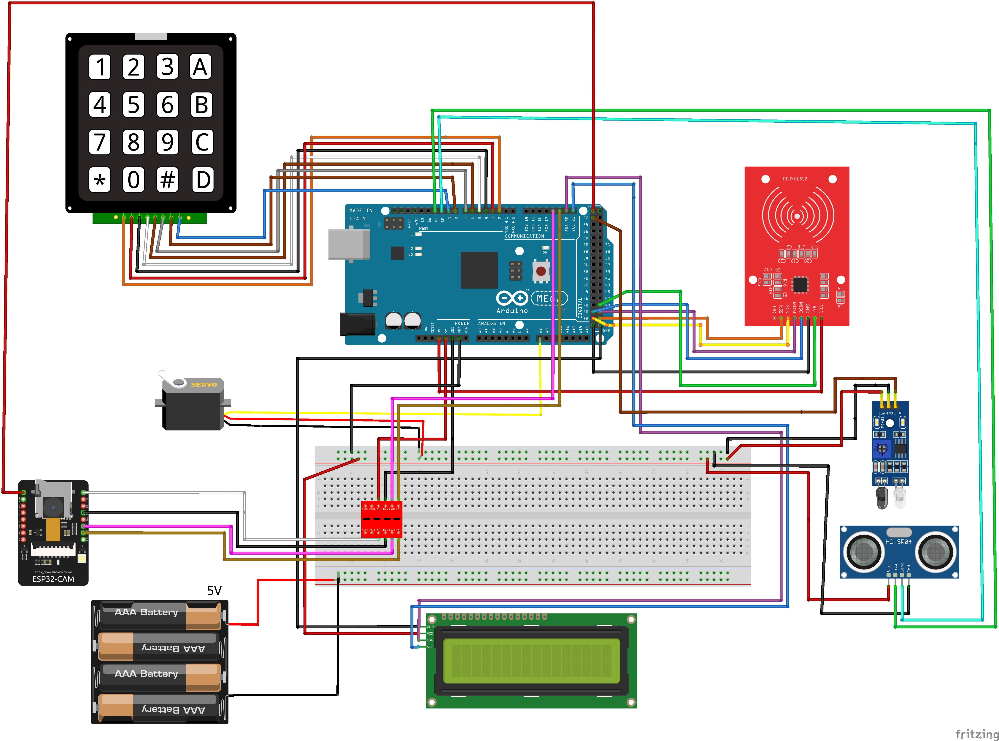
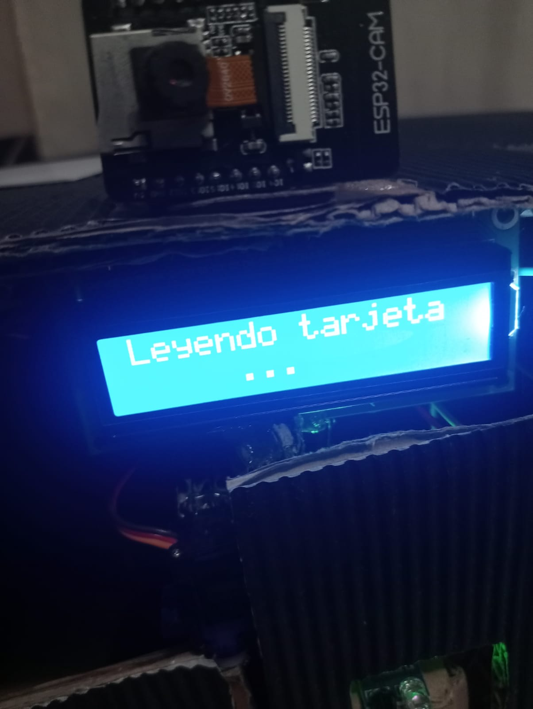
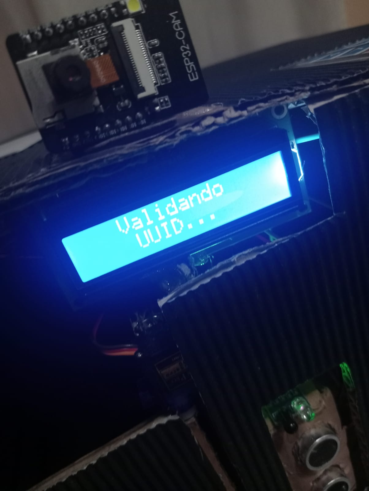
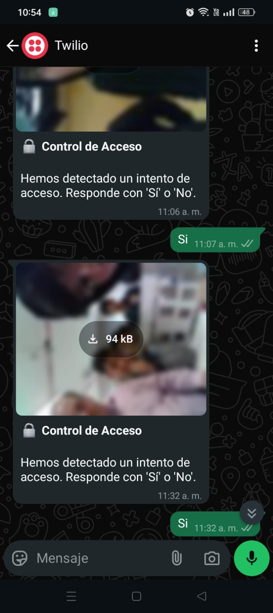

# QoriPunku (SecureGate)

## Visión General

**QoriPunku** ("Puerta de Oro" en quechua) es un sistema de control de acceso inteligente que combina tecnología RFID con verificación remota mediante fotografías. Diseñado para mejorar la seguridad en puntos de acceso, permite la autenticación rápida de usuarios registrados y ofrece una segunda capa de verificación por administrador para visitantes no registrados.

## Características Principales

- **Autenticación RFID**: Identificación rápida mediante tarjetas autorizadas
- **Sistema de respaldo fotográfico**: Captura imágenes de visitantes no autorizados
- **Verificación remota**: Envío de fotografías al administrador vía WhatsApp
- **Control de acceso dual**: RFID para usuarios regulares, aprobación administrativa para visitantes
- **Panel administrativo**: Configuración de parámetros del sistema mediante contraseña
- **Acceso automático**: Apertura de puerta mediante servomotor

## Componentes de Hardware

  
  
  
  
  
  
  
  

## Diagrama del Sistema

  

## Flujo de Funcionamiento

### Acceso con Tarjeta Registrada
1. Usuario presenta la tarjeta RFID al lector
2. El sistema valida el UUID contra la base de datos
3. Si está registrado, el servomotor activa la apertura de la puerta
4. La pantalla LCD muestra mensaje de "Acceso concedido"

### Acceso con Tarjeta No Registrada
1. Usuario presenta la tarjeta RFID no reconocida
2. El sistema detecta la presencia del usuario con sensores ultrasónico e infrarrojo
3. ESP32-CAM captura una fotografía del visitante
4. La imagen se envía al servidor
5. El servidor procesa la imagen y envía un mensaje de WhatsApp al administrador incluyendo:
   - La fotografía del visitante
   - Opciones para aprobar o denegar el acceso
6. El administrador responde por WhatsApp ("si" o "no")
7. El servidor recibe la respuesta y la comunica al sistema
8. Si se aprueba, se abre la puerta y se registra el UUID automáticamente en la base de datos
9. Si se deniega, se muestra mensaje de "Acceso denegado" en el LCD

### Modo Configuración
1. Introducir el código de 5 dígitos en el teclado matricial
2. Acceder al menú de opciones:
   - Cambiar número de teléfono del administrador
   - Ajustar distancia de detección del sensor
   - Cambiar contraseña de administrador
   - Salir del modo configuración

## Panel de Configuración

El sistema cuenta con un panel de configuración protegido por contraseña que permite:

- **Gestión de contacto**: Actualizar el número de teléfono del administrador para las notificaciones de WhatsApp
- **Ajuste de sensores**: Modificar la distancia de activación del sensor ultrasónico
- **Seguridad**: Cambiar la contraseña de acceso al panel de configuración

## Capturas

  
  

  

## Arquitectura del Sistema

El sistema está dividido en tres componentes principales:

### Unidad de Control
- Maneja el lector RFID, pantalla LCD, teclado y servomotor
- Controla los sensores de presencia (ultrasónico e infrarrojo)
- Proporciona interfaz de usuario mediante LCD y teclado
- Gestiona el menú de configuración y validación de entradas

### Unidad de Cámara
- Captura fotografías de alta calidad
- Establece comunicación WiFi con el servidor
- Envía imágenes capturadas al servidor
- Recibe respuestas del servidor sobre el acceso

### Servidor
- Almacena datos de usuarios registrados y configuraciones
- Procesa las imágenes recibidas desde la unidad de cámara
- Envía mensajes de WhatsApp al administrador con la fotografía del visitante
- Recibe y procesa respuestas del administrador
- Comunica decisiones de acceso de vuelta al sistema

## Requisitos de Hardware

- Arduino Mega 2560
- Módulo ESP32-CAM
- Lector RFID RC522
- Pantalla LCD 16x2 con I2C
- Teclado matricial 4x4
- Servomotor para control de cerradura
- Sensor ultrasónico HC-SR04
- Sensor infrarrojo
- Módulo de alimentación
- Cables y protoboard

## Instalación y Configuración

1. **Configuración del hardware**
   - Conectar todos los componentes según el diagrama proporcionado
   - Asegurar alimentación adecuada para todos los módulos

2. **Configuración del servidor**
   - Crear una carpeta `CA` en tu servidor
   - Subir los scripts de la carpeta `Web`
   - Configurar la base de datos con tus credenciales en `config.php`
   - Importar el archivo `Database/QoriPunku.sql` a tu BD
   - Configurar la API de WhatsApp (Twilio) en el script `config.php`

4. **Programación de los microcontroladores**
   - Cargar el firmware en Arduino Mega
   - Cargar el firmware en ESP32-CAM
   - Configurar las credenciales WiFi y URL del servidor

## Aplicaciones

- Control de acceso en oficinas y edificios corporativos
- Seguridad en laboratorios y áreas restringidas
- Control de entrada en condominios y urbanizaciones
- Acceso a zonas sensibles con supervisión administrativa
- Registro de visitantes en instituciones

## Licencia

Este proyecto está bajo la Licencia MIT - consulta el archivo [LICENSE](LICENSE) para más detalles.

## Contacto

Si tienes preguntas o sugerencias, no dudes en contactarme :)

---

  Desarrollado con orgullo en Perú, combinando tradición y tecnología.

